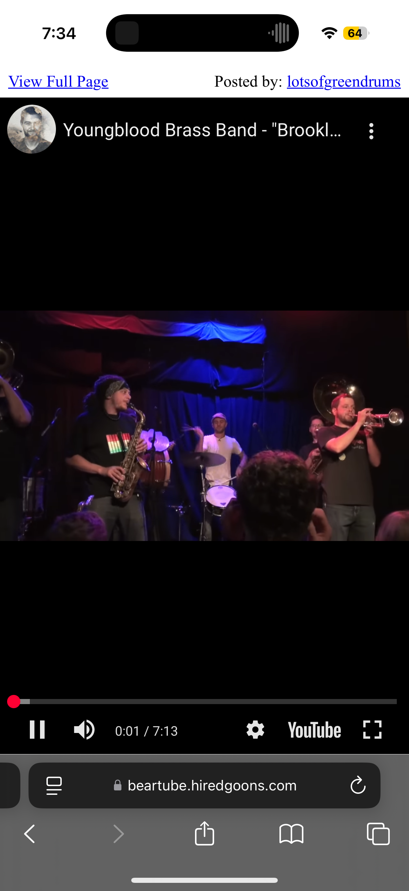
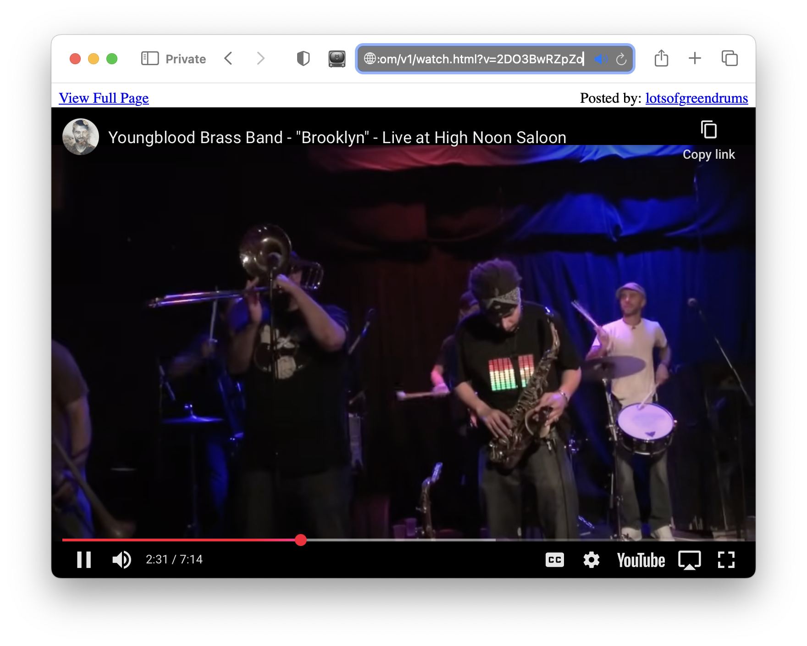

# BearTube

BearTube is a small browser extension to make the drive-by YouTube experience more 2005 than 2025. It puts the video front and center, adhering to the design ethos best expressed by Terry Tate - "condense the nonsense".

# Installation

## macOS

This is more difficult than many applications due to Apple's security theatre. Follow carefully, you may have to improvise because Apple makes changes to the permission process that are out of my control.

1. Download the application from this link [BearTube.zip](https://github.com/msolo/BearTube/releases/download/v1.1.0/BearTube-1.1.0.zip).
2. Go to the `Downloads` folder and run the application once. You will almost certainly get a superfluous warning about being unable to run an untrustworthy application - just dismiss and ignore this annoyance.
3. Right-click the BearTube application select `Open`. You *must* relaunch the application this way. You will get a dialog box asking if you want to allow running the unsigned, untrusted code - yes. You want to do that.
4. The application should now load and it will give you a button to quit it and launch Safari's Extension settings panel instead. It doesn't always work so you may need to go to the Safari Preferences, find the section called `Extensions` and enable the checkbox next to BearTube.
5. You now need to give BearTube permission to run. Click the `Edit Websites...` button in the settings panel. There is a list of `Configured Websites` - you must set each one to `Allow` for the plugin to work correctly.
6. Visit youtube.com. You should see a tv icon next to the location bar and it should be sort of tinted blue.
7. Click a link to a video - it should take you to a giant version of the video with nothing else.

## iOS

The [released version](https://itunes.apple.com/WebObjects/MZStore.woa/wa/viewSoftware?id=6744306910) is available on the AppStorel.

There is also [public TestFlight version](https://testflight.apple.com/join/eMPYnaSv) that can be installed.

Once installed and launched, you still need to visit the Safari sections of the `Settings > Apps > Safari > Extensions` and make sure that BearTube is properly enabled.

This is a security "feature" and cannot be automated. You should give the BearTube extension permission to run automatically on the YouTube related domains.

## Chrome

The unpacked plugin can be manually installed from the source in [`Chrome/BearTube`](https://github.com/msolo/BearTube/tree/master/Chrome/BearTube). You may have to visit [`chrome://extensions`](chrome://extensions) and enter Developer Mode to do this.

Sadly, what was once trivial is now on par with the annoyance level of Safari Extensions.

# Using BearTube

When BearTube encounters a link to a YouTube watch page, it will redirect the browser to a super-sized embedded version. To view the original page, click the "View Full Page" link above the video.

# Screenshots

