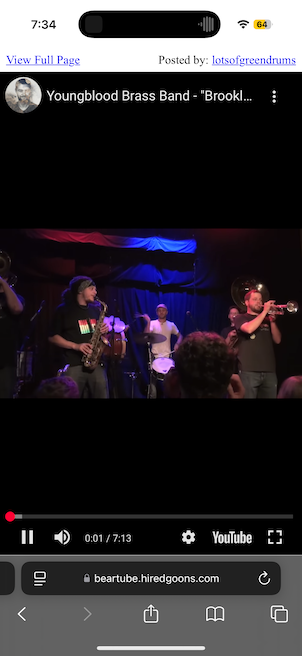

# BearTube

BearTube is a small browser extension to make the drive-by YouTube experience more 2005 than 2025. It puts the video front and center, adhering to the design ethos best expressed by Terry Tate - "condense the nonsense".

# Installation

## macOS

This is more difficult than many applications due to Apple's security theatre. Follow carefully, you may have to improvise because Apple makes changes to the permission process that are out of my control.

1. Download the application from this link [BearTube.zip](https://github.com/msolo/BearTube/releases/download/v1.0.6/BearTube-1.0.6.zip).
2. Go to the `Downloads` folder and right click on the BearTube application. Select `Open`. You must launch the application this way. You will get a dialog box asking if you want to allow running the unsigned, untrusted code - yes. You want to do that.
3. If you see the application load, it will give you a button to quit it and launch Safari's Extension panel instead. It doesn't always work so you may need to go to the Safari Preferences, find the section called `Extensions` and enable the checkbox next to BearTube.
4. This might still be not enough. Visit youtube.com. You should see a tv icon next to the location bar, if it is not glowing blue, you need to click on the tv icon and select `Always allow on youtube.com`.
5. Paste in a link to a youtube video - it should take you to a giant version of the video with nothing else.

## iOS

There is a [public TestFlight version](https://testflight.apple.com/join/eMPYnaSv) that can be installed.

Once installed and launched, you still need to visit the Safari sections of the Settings > Apps > Safari > Extensions and make sure that BearTube is properly enabled.

This is a security "feature" and cannot be automated.

## Chrome

The unpacked plugin can be manually installed from the source in [`Chrome/BearTube`](https://github.com/msolo/BearTube/tree/master/Chrome/BearTube). You may have to visit [`chrome://extensions`](chrome://extensions) and enter Developer Mode to do this.

Sadly, what was once trivial is now on par with the annoyance level of Safari Extensions.

# Using BearTube

When BearTube encounters a link to a YouTube watch page, it will redirect the browser to a super-sized embedded version. To view the original page, click the "View Full Page" link above the video.

# Screenshots

# TODO

 * The application is ~330K to deploy 2K of Javascript, but also seems to require 6MB of PNG files to conform to "best practices." Condense nonsense. The Chrome extension is 60K and manages to look decent doing it.
 * Eliminate server side component? The fastest RPC is one that doesn't happen.
